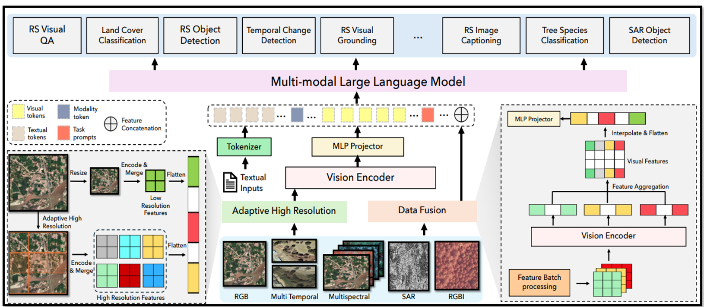
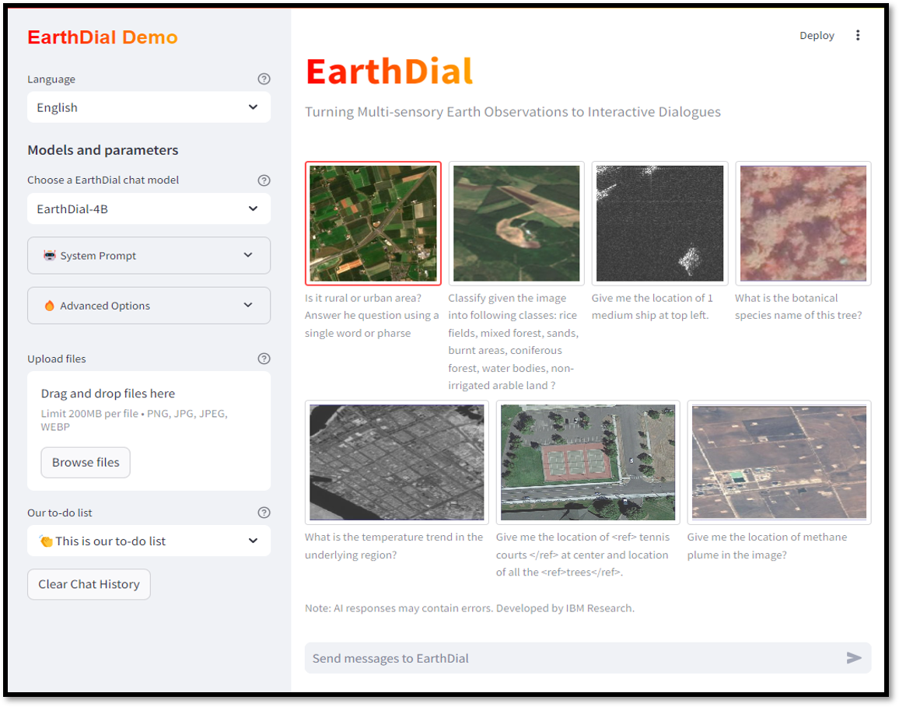

# EarthDial : Turning Multi-sensory Earth Observations to Interactive Dialogues [CVPR-2025]
<p align="center">
    
</p>

#### [Sagar Soni]()\*, [Akshay Dudhane]()\*, [Hiyam Debary]()\*, [Mustansar Fiaz]()\*, [Muhammad Akhtar Munir](), [Muhammad Sohail Danisho](), [Paolo Fraccaro](), [Campbell  Watson](), [Levente J. Klein](), [Salman Khan]() and [Fahad Khan]()
\* Equally contributing first authors

#### **IBM Research Lab, Mohamed bin Zayed University of AI**

[](https://arxiv.org/abs/2412.15190)
[](https://huggingface.co/datasets/akshaydudhane/EarthDial-Dataset)
[](https://huggingface.co/akshaydudhane/EarthDial_4B_RGB)

---

## 📢 Latest Updates

- **Time line**: EarthDial paper status to **CVPR-25** 🎉. 
- **Time line**: EarthDial paper is released [arxiv link](https://arxiv.org/abs/2412.15190). 🔥🔥
---


##  EarthDial: Overview

Automated analysis of vast Earth observation data via interactive Vision-Language Models (VLMs) can unlock new opportunities for environmental monitoring, disaster response, and resource management. Existing generic VLMs do not perform well on Remote Sensing data, while the recent Geo-spatial VLMs remain restricted to a fixed resolution and few sensor modalities. In this paper, we introduce EarthDial, a conversational assistant specifically designed for Earth Observation (EO) data, transforming complex, multi-sensory Earth observations into interactive, natural language dialogues. EarthDial supports multi012 spectral, multi-temporal, and multi-resolution imagery, enabling a wide range of remote sensing tasks, including classification, detection, captioning, question answering, visual reasoning, and visual grounding. To achieve this, we introduce an extensive instruction tuning dataset comprising over 11.11M instruction pairs covering RGB, Synthetic Aperture Radar (SAR), and multispectral modalities such as Near-Infrared (NIR) and infrared. Furthermore, EarthDial handles bi-temporal and multi-temporal sequence analysis for applications like change detection. Our extensive experimental results on 37 downstream applications demonstrate that EarthDial outperforms existing generic and domain024 specific models, achieving better generalization across various EO tasks.

---
## Contents
- [Install](#install)
- [Model Property]()
- [Dataset]()
- [Train](#train)
- [Evaluation](#evaluation)

## Install

1. Clone this repository and navigate to EarthDial folder
```bash
git clone https://github.com/hiyamdebary/EarthDial.git
cd EarthDial
```

2. Install Package
```Shell
conda create -n earthdial python=3.9 -y
conda activate earthdial
pip install --upgrade pip  # enable PEP 660 support
pip install -e .
```

3. Install additional packages for training cases
```
pip install flash-attn==2.3.6 --no-build-isolation
```

### Upgrade to latest code base

```Shell
git pull
pip uninstall transformers
pip install -e .
```

## EarthDial Weights and Demo
Please check out our [Model]() for all public EarthDial checkpoints, and check demo section for instructions on how to run the earthdial demo.

## Train 
(Asll the checkpoints will be available  soon)
### Stage 1 : RS Conversational Pretraining
### Stage 2 : RS RGB and Temporal finetuning
### Stage 3 : RS Multispectral and SAR Finetuning:

We train EarthDial on 8 A100 GPUs with 80GB memory. To train on fewer GPUs, you can reduce the `per_device_train_batch_size` and increase the `gradient_accumulation_steps` accordingly. Always keep the global batch size the same: `per_device_train_batch_size` x `gradient_accumulation_steps` x `num_gpus`.

### Hyperparameters

Both hyperparameters used in pretraining and finetuning are provided below.

| Hyperparameter | Global Batch Size | Learning rate | Epochs | Max length | Weight decay |
| --- | ---: | ---: | ---: | ---: | ---: |
| EarthDial-4B | 128 | 4e-5 | 1 | 4096 | 0.1 |

## Evaluation

We evaluate EarthDial on a diverse set of 37 benchmarks. To ensure the reproducibility, we evaluate the models with greedy decoding. We do not evaluate using beam search to make the inference process consistent with the chat demo of real-time outputs.
Evaluation script will updated soon.
## 🏆 Contributions

- **RS multimodal instruction following dataset.** We present a novel data generation pipeline, to leverage existing object detection dataset to create short descriptions of the images, to create conversations using the generated text alone. Further, we add visual question-answering and scene classification abilities  using their corresponding datasets. This results in a total of 11.11M instruction pairs for RS domain.
- **EarthDial.** Leveraging our dataset, we finetune InternVL2 to create the remote sensing-domain vision-language model - EarthDial. Our 3 Stage model fine-tuning is efficient and avoids forgetting the necessary context embedded in RGB,Multi temporal and Multi spectral datasets, whose MLP projection is trained to align images into the word embedding space of the LLM (Phi-3 Mini). This allows EarthDial to retain the conversation and instruction following abilities of SoTA VLMS and extend its domain-knowledge to remote sensing tasks.  

- **Evaluation Benchmark.** We also address the lack of evaluation benchmarks to assess the capability of existing VLMs on remote-sensing conversations. To this end, we setup evaluation protocols for conversation grounding in RS, as well as a setup a suite of tasks to allow comparisons with future efforts in this direction. We show various supervised as well as  zero-shot evaluations for different remote sensing tasks, including image captioning, visual question answering and scene classification to demonstrate the generalisability of EarthDial conversational VLM.

---
## 👁️💬 EarthDial : Grounded Large Vision-Language Model for Remote Sensing

EarthDial can accomplish multiple tasks for remote-sensing (RS) image comprehension in a unified framework. Given suitable task tokens and user queries, the model can generate visually grounded responses (text with corresponding object locations - shown on top), visual question answering on images and regions (top left and bottom right, respectively) as well as scene classification (top right) and normal natural language conversations (bottom). This makes it the first RS VLM with grounding capability. 

---

## 🛰️ EarthDial : Architecture

An overview of EarthDial - the first grounded large vision-language model for remote sensing. Given an image input together with a user query, a visual backbone is first used to encode patch-level tokens at a higher resolution via interpolating positional encodings. A multi-layer perceptron (MLP) is used to adapt vision-tokens to language space suitable for input to a Large Language Model (Phi3 mini). Besides visual inputs, region locations can also be input to the model together with task-specific prompts that specify the desired task required by the user. Given this context, the LLM can generate natural language responses interleaved with corresponding object locations. EarthDial can perform multiple tasks as shown on top e.g., scene classification, image/region captioning, VQA and grounded conversations.

<p align="center">
  
</p>

---

## 🔍 RS Multimodal Instruction Dataset

Types of annotations available in the EarthDial instruction-set. For a given RS image, we obtain object attribute and relationship information, referring expressions and region captions along with their corresponding region annotations. We created our 11.11M RS instruciton pairs and data will be available soon.
</p>

##  Model Demo

Please refer to demo folder for the more information about Earthdial demo.

<p align="center">
  
</p>

</p>
<!-- 


## 🤖 Qualitative results of EarthDial

Qualitative results of EarthDial. (<em>left-right</em>) Results are shown on grounding, referring object detection, and disaster/damage detection. The user can provide task-specific tokens (e.g., <strong>[grounding]</strong>) to shape model responses according to the desired behavior. The model can generate textual responses (<em>right</em>), only visual grounding (<em>center</em>) and both text and object groundings interleaved together (<em>left</em>). The model can also specify object types, object counts, object attributes and object relationships.
<p align="center">
  
</p>

---

## 🤖 Visual Question Answering
Qualitative examples for Visual Question Answering tasks. EarthDial is able to hold multi-turn conversations, based on various types of questions, including presence, count, complex comparisons and so on. It is able to detect objects and hold conversations against low resolution images as well.
<p align="center">
  
</p>

---

## 🤖 Scene Classification
Qualitative examples for scene classification. We give the model all the classes from the dataset and ask to choose only one.
<p align="center">
  
</p>

---

## 🤖 Grounded Description
When asked to describe the image with the special token '[grounding]', EarthDial outputs both the description of the image as well as the bounding boxes for all the objects detected.
<p align="center">
  
</p>

---

## 🤖 Referring Expression
When asked about an object as a referred expression, EarthDial is able to locate it and draw rotated bounding boxes around it correspondingly.
<p align="center">
  
</p>
<p align="center">
  
</p> -->

---

<!-- ## 🤖 Region Caption
Qualitative examples for region-based captioning. Given a bounding box, EarthDial is able to provide brief descriptions about the area or the object covered by the bounding box.
<p align="center">
  
</p> -->

---

## 📜 Citation

```bibtex
@article{soni2025earthdial,
  title={EarthDial: Turning Multi-sensory Earth Observations to Interactive Dialogues}, 
  author={Sagar Soni, Akshay Dudhane, Hiyam Debary, Mustansar Fiaz, Muhammad Akhtar Munir, Muhammad Sohail Danisho, Paolo Fraccaro, Campbell Watson, Levente J. Klein, Salman Khan, Fahad Khan},
  journal={ArXiv},
  year={2025},
  url={https://arxiv.org/abs/2412.15190}
} -->

---

## 🙏 Acknowledgement
IBM Research and MBZUAI University for their collaborative support and guidance.

---

